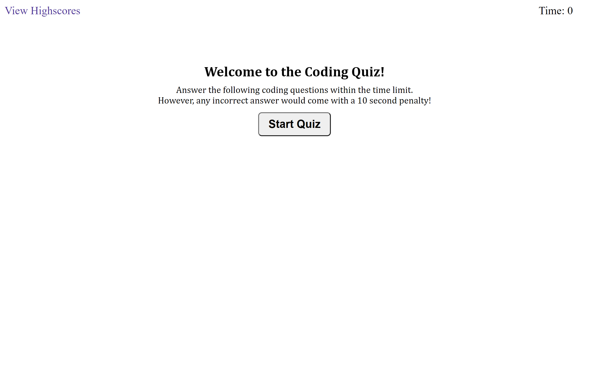
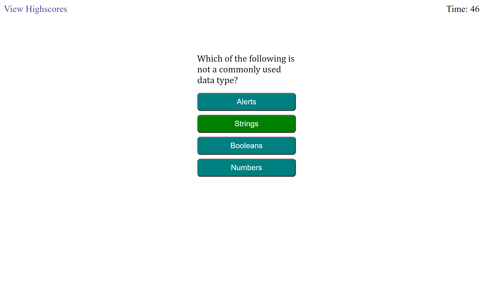
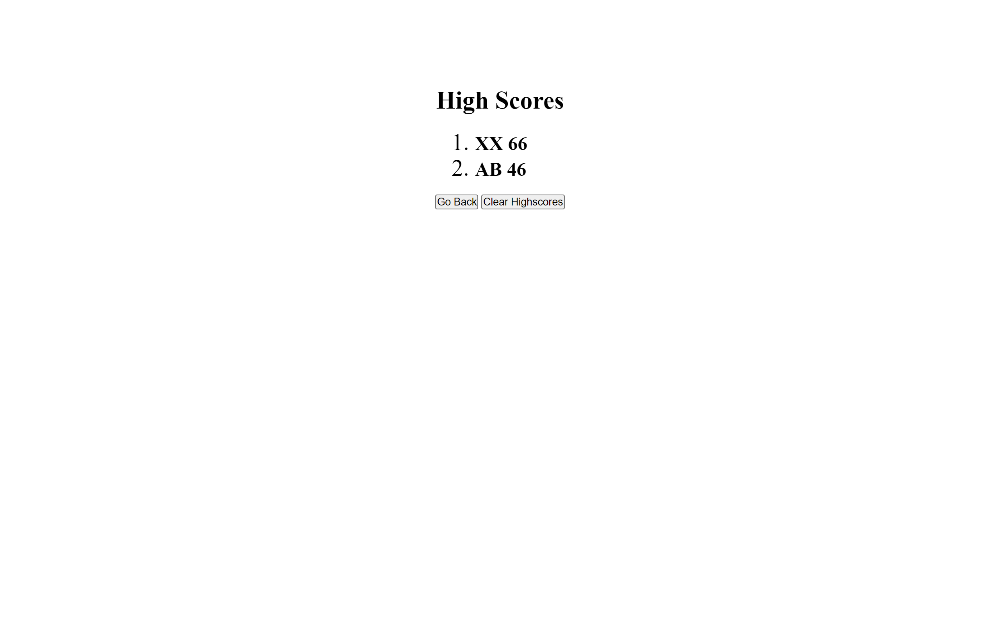

# Project Title: Timed-Coding-Quiz
An application of timed coding quiz with multiple-choice questions.

## Project Description:
This project presents a timed coding quiz with multiple-choice questions, which will run in the browser and feature dynamically updated HTML and CSS powered by a JavaScript code. It is presented with a clean, polished, and responsive user interface.

The project has a total of 5 questions with 4 choices each. Each question has a 15 sec time limit and countdown clock is displayed on the page. The scores are presented at the end for each user by their initials.

## How to Use the Project:
Using this project will give new developers an idea of the fundamnetal principles in powering HTML and CSS with a JavaScript for designing a timed quiz. The design provided a clean and responsive user interface.

## Credits:
Thanks to Instructor Mahyar Mottaghi Zadeh for providing relevent training and rescources for this project.

## Website URL and Screenshots:

https://veerak21.github.io/timed-coding-quiz/ 

Welcome page screenshot.

Screenshot showing questions with multiple choices answers.

Screenshot showing the highscores.

